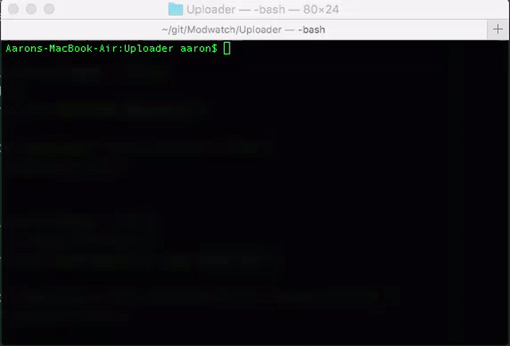

# Modwatch Uploader

This is a work in progress CLI for the Modwatch API. The idea behind it is not to have all Modwatch users interact with the API via terminal (although that would be awesome). The utility and API methods used by the CLI are kept separate, unit tested, and are able to be pulled in on their own, so getting them working flawlessly with the CLI should mean they will work without fail in a GUI, to be written once the libs are stable.

### Dependencies

- NodeJS

### Development

- `git clone https://github.com/Modwatch/Uploader.git`
- `cd Uploader`
- `npm link`

To rebuild as you work, you can run `npm run watch`. This will rebuild `cli.js` any time files change in the `src/` directory. Tests can be run via `npm run test`, or continuously with `npm run test:watch`.

### Gifs Are Great

